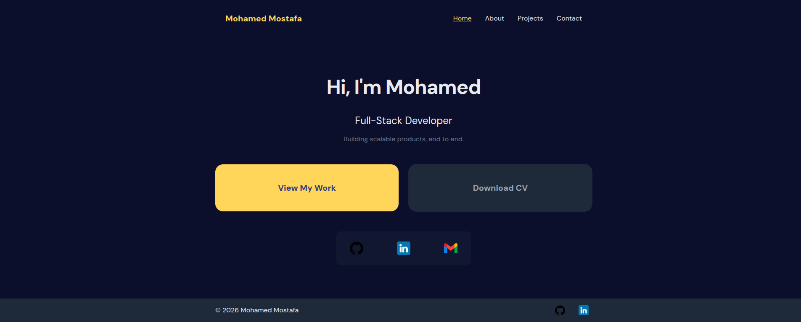
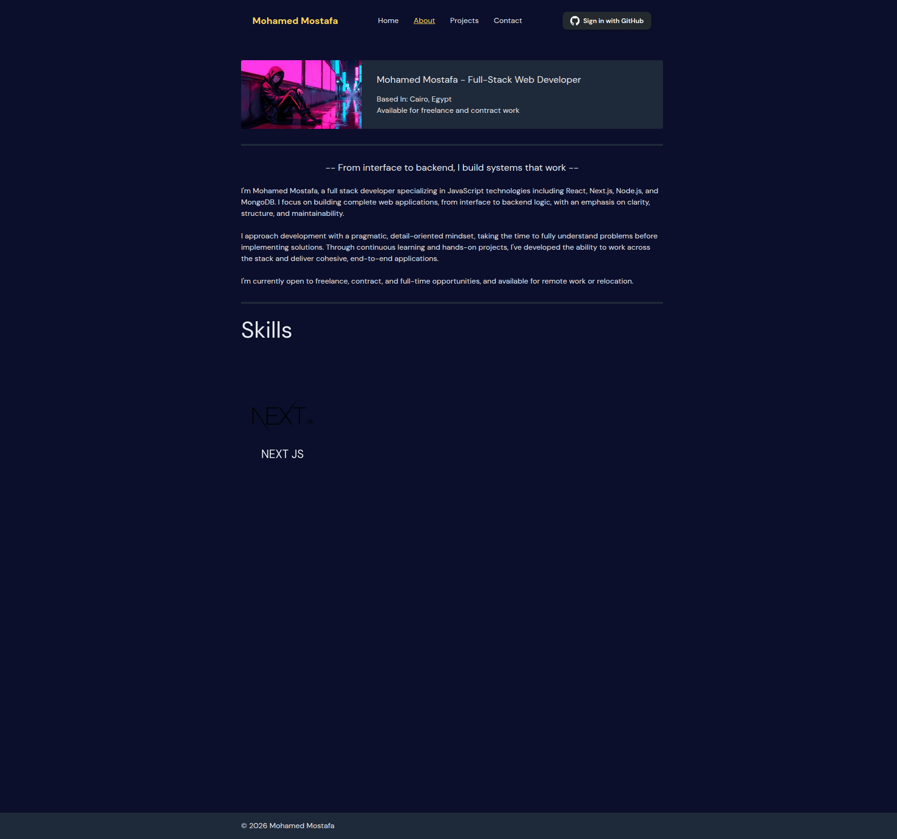
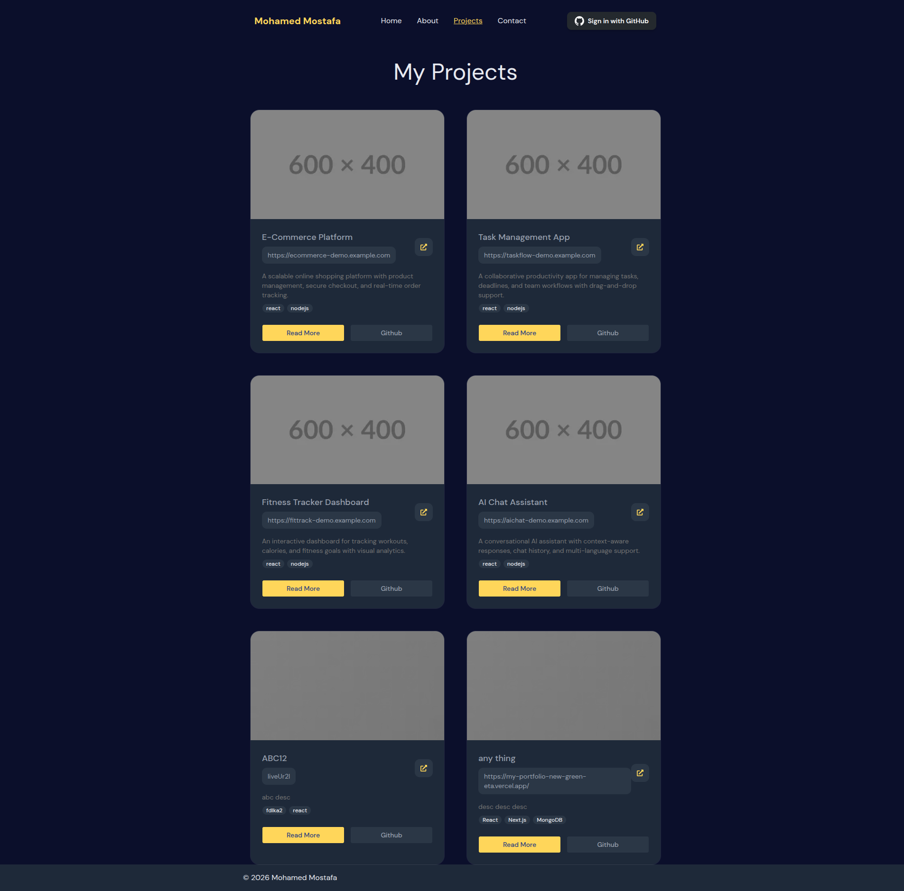
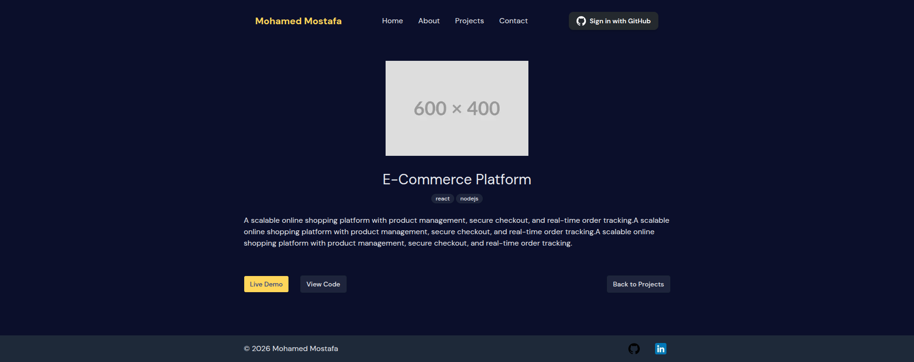
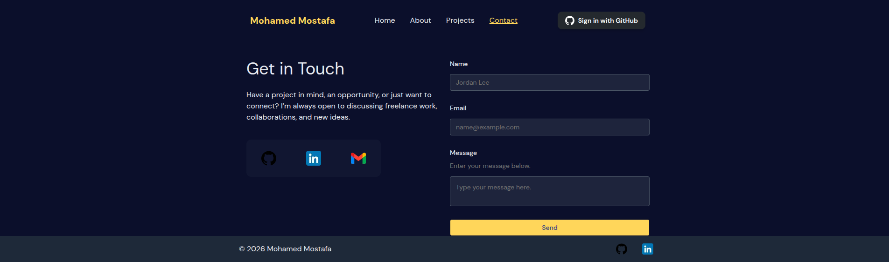
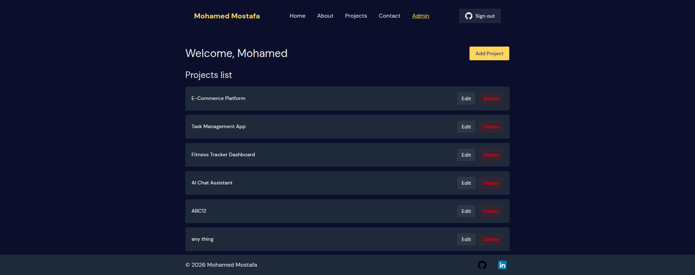
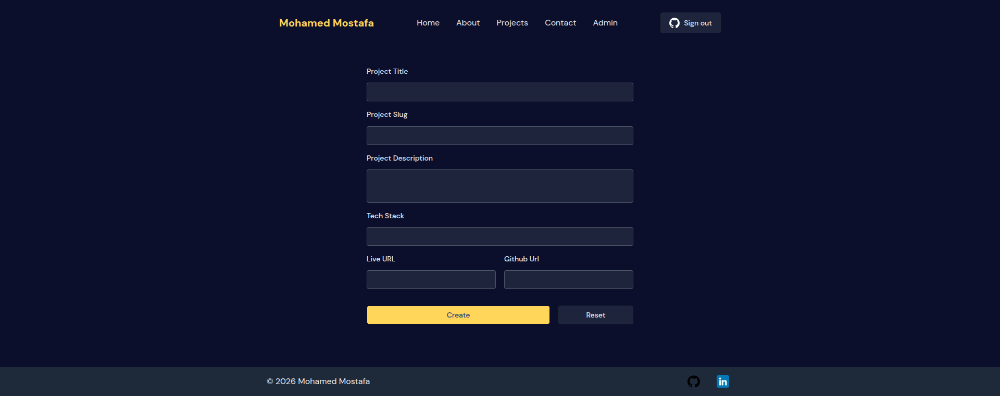
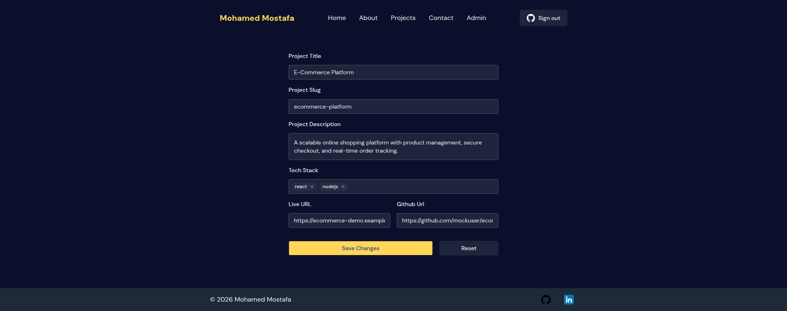
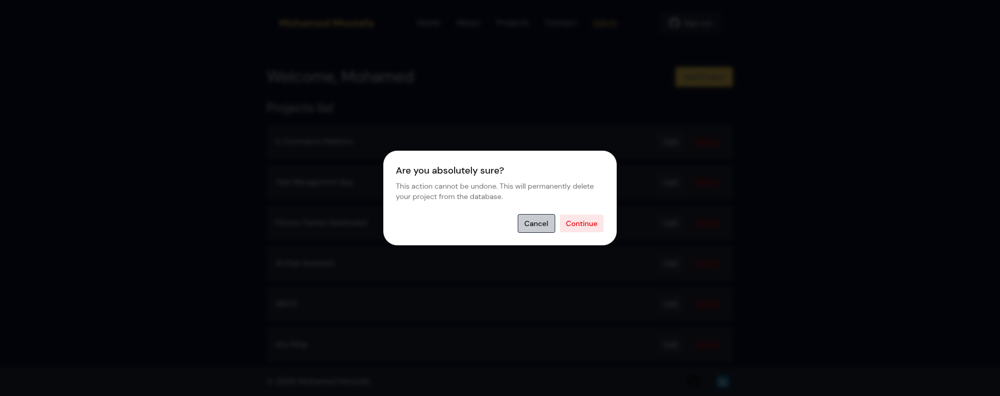

# My Portfolio

A modern and responsive portfolio website built with **Next.js 16**, **React 19**, and **Supabase**.

This project showcases personal projects, developer information, and includes a secure admin dashboard for managing portfolio projects with full CRUD functionality.

🌐 **Live Demo:**  
https://my-portfolio-new-green-eta.vercel.app/

📦 **GitHub Repository:**  
https://github.com/mohamedmostafakhudari/my-portfolio-new

---

# Features

- Responsive and modern portfolio design
- Homepage, About, Projects, and Contact pages
- Dynamic project details pages
- Admin dashboard for project management
- Full CRUD operations for projects
- GitHub authentication using NextAuth
- Protected admin routes
- Supabase database integration
- Contact form support
- Form validation with React Hook Form
- Reusable UI components with Shadcn UI
- Smooth animations using Motion
- Local mock API support using JSON Server

---

# Tech Stack

## Frontend

- Next.js 16
- React 19
- Tailwind CSS v4
- Shadcn UI
- Motion
- React Icons

## Backend & Database

- Supabase
- NextAuth v5
- Supabase SSR
- JSON Web Tokens (JWT)

## Forms & Utilities

- React Hook Form
- Class Variance Authority
- Tailwind Merge
- JSON Server

---

# Installation

Ensure you have the following before starting:

- **Node.js:** version 20.9 or later
- **Package Manager:** npm, yarn, or pnpm

## 1. Clone the Repository

```bash
git clone https://github.com/mohamedmostafakhudari/my-portfolio-new.git
cd my-portfolio-new
```

## 2. Install Dependencies

```bash
npm install
# or
yarn install
# or
pnpm install
```

## 3. Environment Setup

Create a local environment file:

```bash
cp .env.example .env.local
```

Then add your environment variables inside `.env.local`:

```env
DATABASE_URL=

NEXT_PUBLIC_API_URL=
NEXT_PUBLIC_SUPABASE_URL=
NEXT_PUBLIC_SUPABASE_PUBLISHABLE_KEY=
SUPABASE_SECRET_KEY=
SUPABASE_JWT_SECRET=
MY_SUPABASE_USER_ID=

AUTH_GITHUB_ID=
AUTH_GITHUB_SECRET=

AUTH_SECRET=

ADMIN_EMAIL=

```

---

# Usage

Follow these steps to run the project locally or prepare it for production.

## 1. Run Development Server

```bash
npm run dev
# or
yarn dev
# or
pnpm dev
```

Open:

```txt
http://localhost:3000
```

---

## 2. Run Mock API Server

```bash
npm run server
```

This starts JSON Server on:

```txt
http://localhost:3001
```

---

## 3. Build for Production

```bash
npm run build
```

This command generates the optimized `.next` production build.

---

## 4. Start Production Server

```bash
npm run start
```

---

# Project Structure

```bash
.
├── app
│   ├── about
│   ├── admin
│   ├── api
│   ├── contact
│   ├── login
│   └── projects
├── components
│   ├── aboutpage
│   ├── admin
│   ├── auth
│   ├── contact
│   ├── form
│   ├── homepage
│   ├── layout
│   ├── posts
│   ├── projects
│   ├── shared
│   └── ui
├── data
├── hooks
├── lib
│   ├── actions
│   └── supabase
├── public
├── db.json
├── package.json
└── README.md
```

---

# Screenshots

## Homepage



## About



## Projects Page





## Contact



## Admin Dashboard









---

# Demo

🔗 Live Website:  
https://my-portfolio-new-green-eta.vercel.app/

---

# Future Improvements

- Add blog functionality
- Add dark/light mode toggle
- Improve project filtering and search
- Add image upload support for projects
- Add analytics dashboard
- Improve accessibility and SEO
- Add unit and integration testing
- Add project categories and tags filtering

---

# Author

## Mohamed Mostafa

- GitHub: https://github.com/mohamedmostafakhudari
- Portfolio: https://my-portfolio-new-green-eta.vercel.app/

---
